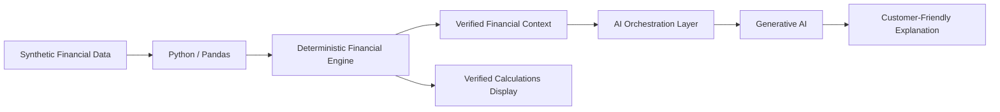

# FlowWise 💰🤖

### AI-Enabled Financial Wellness Platform

FlowWise is an independent AI TPM portfolio project exploring how
generative AI can make everyday financial data easier to understand
while keeping critical financial calculations deterministic,
traceable, and separate from the LLM.

> **Portfolio prototype only. All financial data is synthetic.
> FlowWise does not provide financial advice.**

---

## The Problem

Traditional banking experiences provide balances and transaction
history, but customers may still struggle to answer practical questions:

- How much money is actually available after upcoming obligations?
- Where am I spending the most?
- How would a planned purchase affect my cash flow?
- Can financial information be explained in plain language?

FlowWise explores a proactive financial-wellness experience built
around those questions.

---

## MVP Experience

The working prototype currently supports:

- Financial dashboard
- Synthetic transaction processing
- Income and expense calculations
- Net cash-flow calculation
- Spending-by-category analysis
- Recurring-obligation identification
- Available-to-spend calculation
- Planned-purchase analysis
- AI-powered financial explanations
- Unsupported-question handling
- Graceful AI-service failure behavior

### Example

A customer asks:

> Can I afford a $700 vacation?

The deterministic Python layer calculates:

| Metric | Value |
|---|---:|
| Available to Spend | $2,042 |
| Planned Purchase | $700 |
| Remaining Available | $1,342 |
| Adjusted Monthly Cash Flow | $905 |

The verified results are then supplied to the generative AI layer,
which produces a customer-friendly explanation.

---

## AI Architecture

A core design principle is:

**Python calculates. AI explains.**

The LLM is not treated as the system of record for financial
calculations.

---

## Why Separate AI from Financial Calculations?

The architecture intentionally keeps financial computation outside the
LLM to improve:

- Predictability
- Auditability
- Explainability
- Numerical consistency
- Resilience when the AI service is unavailable

Generative AI is used where it provides the most value:
natural-language interaction and explanation.

---

## AI Guardrails

FlowWise AI is designed to:

- Use supplied financial context
- Avoid inventing balances or transactions
- Avoid generating unsupported credit information
- Identify insufficient information
- Avoid specific investment recommendations
- Communicate limitations
- Explain verified calculations rather than replacing them

Example unsupported question:

> What is my credit score?

Because credit-score data is unavailable, FlowWise should identify the
information gap rather than invent a score.

---

## Technology

- Python
- Streamlit
- Pandas
- OpenAI API
- Git
- GitHub
- Mermaid

---

## TPM Approach

This project was approached as a TPM-led product initiative rather than
only a software implementation.

The work includes:

- Customer problem definition
- MVP scoping
- Product requirements
- Technical architecture
- AI architecture decisions
- AI guardrails
- Dependency sequencing
- Delivery roadmap
- Program risk management
- AI evaluation strategy
- Future production-readiness considerations

---

## Program Documentation

### Product

- [Product Requirements Document](docs/product/PRD.md)

### Architecture

- [System Architecture](docs/architecture/system-architecture.md)

### Technical Decisions

- [ADR-001: AI Boundaries](docs/decisions/ADR-001-ai-boundaries.md)

### Execution

- [Delivery Roadmap](docs/execution/roadmap.md)
- [Risk Register](docs/execution/risk-register.md)

### AI

- [AI Evaluation Plan](docs/ai/evaluation-plan.md)

---

## AI Evaluation

The MVP evaluation strategy includes supported, unsupported, and
boundary-testing scenarios.

Evaluation dimensions include:

- Groundedness
- Numerical consistency
- Limitation handling
- Product-boundary compliance
- Response usefulness

The goal is to evaluate AI behavior systematically rather than relying
only on subjective prompt testing.

---

## Production Evolution

The current implementation is intentionally lightweight.

A production banking implementation would require additional
capabilities such as:

- Secure banking-data APIs
- Authentication and authorization
- Encryption
- Customer consent management
- Audit logging
- Persistent data storage
- AI observability
- Automated model evaluation
- Security and privacy review
- Regulatory and compliance review

These capabilities are documented as future-state considerations and
are not represented as implemented MVP functionality.

---

## Project Status

**MVP v1 — Complete**

The current version demonstrates the end-to-end product concept,
deterministic financial intelligence, responsible generative AI
integration, and TPM program artifacts.

---

## About This Project

FlowWise is an independent portfolio project created to demonstrate
technical product/program management thinking across AI product
strategy, architecture, execution, risk management, and responsible
AI design.