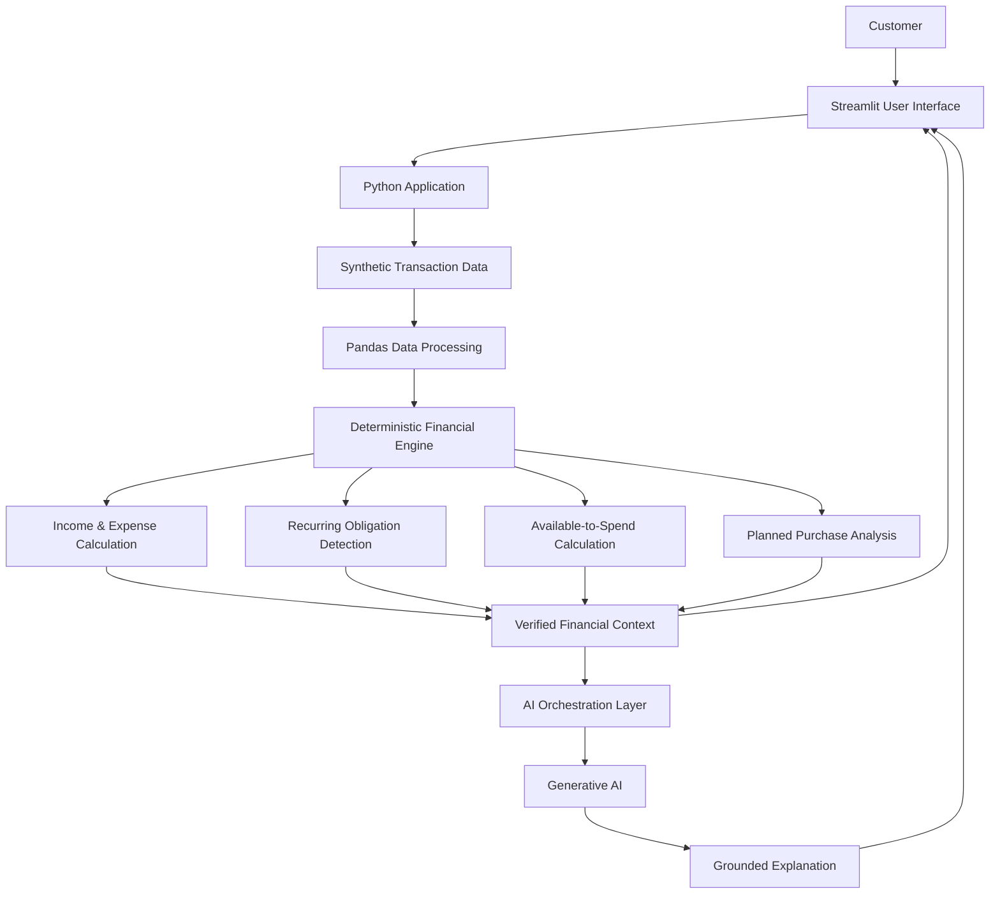

# FlowWise System Architecture

## Overview

FlowWise is an AI-enabled financial wellness prototype that combines
deterministic financial processing with generative AI explanations.

The architecture intentionally separates financial calculations from
the generative AI layer.

## High-Level Architecture

## Component Responsibilities

### Streamlit User Interface

Provides the customer-facing experience including:

- Financial dashboard
- Transaction history
- Spending insights
- Planned purchase analysis
- AI financial assistant

### Synthetic Data Layer

Provides simulated banking transaction data for the prototype.

No real customer banking information is used.

### Pandas Data Processing

Processes transaction data and prepares it for financial calculations.

### Deterministic Financial Engine

Acts as the source of truth for numerical financial calculations.

Responsibilities include:

- Income calculation
- Expense calculation
- Net cash flow
- Recurring obligations
- Available-to-spend calculation
- Planned-purchase impact

### AI Orchestration Layer

Creates structured context containing verified financial outputs and
passes that context to the generative AI service.

It also applies instructions and guardrails controlling how the model
should respond.

### Generative AI Layer

Transforms verified financial context into natural-language
explanations.

The generative AI layer does not serve as the source of truth for
financial calculations.

## Example Request Flow

Customer asks:

> Can I afford a $700 vacation?

### Step 1 — Retrieve Financial Context

FlowWise retrieves the customer's synthetic financial information.

### Step 2 — Deterministic Calculation

Python calculates:

- Available to spend: $2,042
- Planned purchase: $700
- Remaining available: $1,342
- Adjusted monthly cash flow: $905

### Step 3 — Build AI Context

The verified results are converted into structured context for the AI.

### Step 4 — Generate Explanation

The AI receives the verified values and explains the impact of the
purchase in natural language.

### Step 5 — Display Result

The customer sees both:

- AI-generated explanation
- Verified calculation results

## Failure Behavior

If the generative AI service is unavailable:

- Dashboard remains operational
- Transaction processing continues
- Cash-flow calculations continue
- Planned-purchase calculations continue
- Only the conversational explanation is unavailable

This prevents an AI-service dependency from disabling core financial
functionality.

## Future-State Architecture

A production implementation could replace prototype components with:

- Secure banking-data APIs
- API gateway
- Account and transaction microservices
- Event streaming
- Persistent database
- Identity and access management
- Encryption and secrets management
- AI observability
- Model evaluation pipeline
- Audit logging
- Customer consent management

These capabilities are intentionally outside the current MVP scope.